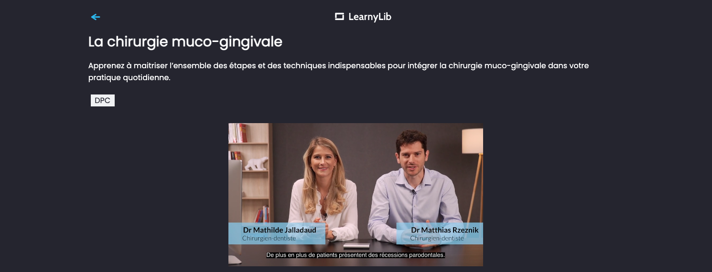
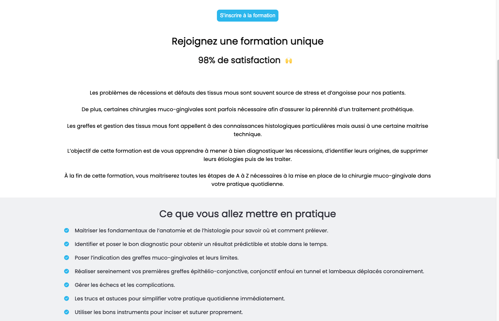
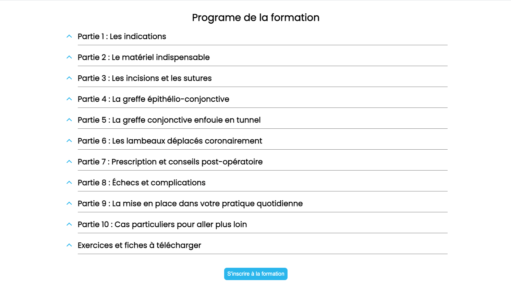
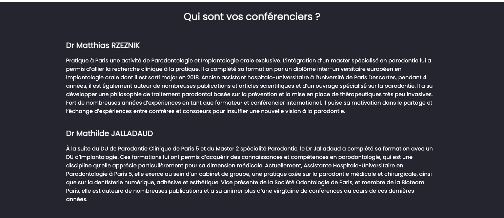

# Integration de la nouvelle page programme sur la plateforme learnylib
(lire attentivement le readme pour récupérer certaines infos)

Les données de cette page sont totalement indépendantes du reste de l'application.

À chaque formation mise en ligne, il va falloir importer manuellement les datas dans le dossier "data" :wink:, pour alimenter la "page programme".

## Résultat

## Récupérer l'id du teaser 

1 - Se connecter sur vimeo (pour des raisons de sécurité évidente je n'ai pas mis les codes à dispo sur ce readme). Pour les récupérer s'adresser à manu.

2 - Cliquez sur l'onglet "vidéos" à gauche de l'écran :

3 - Sélectionner une filière. Pour l'exemple nous allons prendre "santé visuelle" => puis aller dans le dossier "teaser"

4 - Vous cliquez sur un teaser et récupérez son id dans la barre de navigation. 

Remarque :

L'URL de l'api utilisé pour récupérer les photos dans le composant Teachers ne fonctionne plus.